# 🏢 Companydb Database 

## 1. Introduction
This project demonstrates the creation and management of a **Company Database** using MySQL.  
It covers **DDL (Data Definition Language)** and **DML (Data Manipulation Language)** operations such as creating tables, inserting data, and retrieving results using clauses like `SELECT`, `WHERE`, `AND`, `OR`, `LIKE`, `BETWEEN`, `ORDER BY`, `IN`, `LIMIT`, `ALIAS`, and `DISTINCT`.  
The database stores company information such as **Departments** and **Employees**, showing practical use of constraints and queries.

## 2. Database & Tables

### 🗄️ Database: companydb
Holds all company-related data (departments & employees).  
Uses **constraints** like `PRIMARY KEY`, `FOREIGN KEY`, `NOT NULL`, and `UNIQUE` for data integrity.

```sql
CREATE DATABASE companydb;
USE companydb;
```
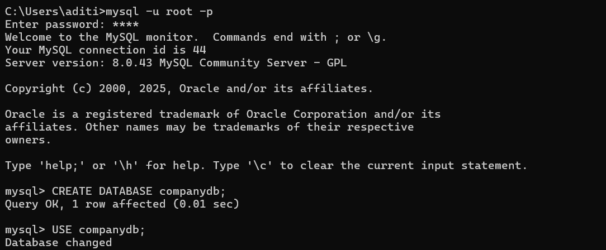

---

### 📋 Table: department
| Field     | Type         | Constraints   | Description              |
|-----------|--------------|---------------|--------------------------|
| dept_id   | INT          | PRIMARY KEY   | Unique department ID     |
| dept_name | VARCHAR(50)  | NOT NULL      | Department name          |

🔹 Example:
```sql
INSERT INTO department VALUES (1, 'HR'), (2, 'IT'), (3, 'Finance');
```
---

### 📋 Table: employee
| Field      | Type         | Constraints             | Description             |
|------------|--------------|-------------------------|-------------------------|
| emp_id     | INT          | PRIMARY KEY             | Employee ID             |
| emp_name   | VARCHAR(50)  | NOT NULL                | Employee name           |
| salary     | INT          | NULL allowed            | Employee salary         |
| dept_id    | INT          | FOREIGN KEY (department)| Department assigned     |
| hire_date  | DATE         | NOT NULL                | Date of joining         |
| city       | VARCHAR(50)  | NULL allowed            | Employee’s city         |

🔹 Example:
```sql
INSERT INTO employee (emp_id, emp_name, salary, dept_id, hire_date, city)
VALUES
(101, 'Aditi', 50000, 2, '2022-01-10', 'Pune'),
(102, 'Rahul', 40000, 1, '2021-07-23', 'Mumbai'),
(103, 'Sneha', 60000, 3, '2020-03-15', 'Delhi'),
(104, 'Karan', 45000, 2, '2023-05-05', 'Pune'),
(105, 'Meera', 70000, 3, '2022-11-18', 'Bangalore');

```
```sql
SELECT * FROM department;
SELECT * FROM employee;

```
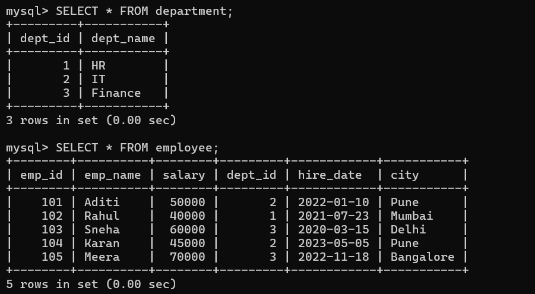
---

## 3. SQL Commands Explained

### 🔍 SELECT  
The `SELECT` statement is used to retrieve specific columns or all data from a table.  
It allows us to view employee details like name, salary, department, etc.  

👉 This query only shows employee names and their salaries, ignoring other columns.
```sql
SELECT emp_name, salary FROM employee;
```
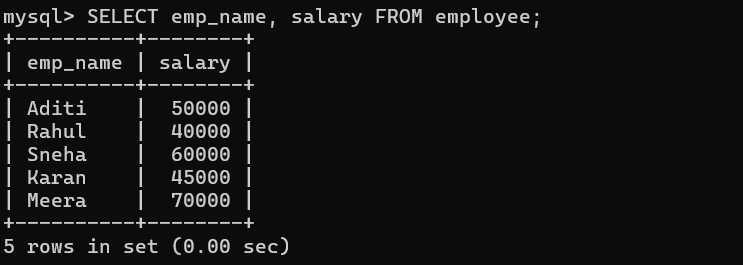

👉 This query only shows employee id and their name and city , ignoring other columns.
```sql
   SELECT emp_id, emp_name,city  FROM employee;
```
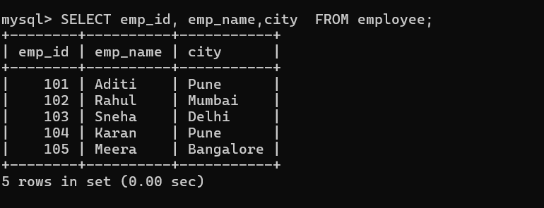

---

### 🎯 WHERE  
The `WHERE` clause filters rows based on a given condition.  
It helps narrow down records instead of showing the full table.  

👉 This returns only employees located in Pune.  
```sql
SELECT * FROM employee WHERE city = 'Pune';
```
👉 This returns only employee which has emp_id=104.  
```sql
SELECT * FROM employee WHERE emp_id=104;
```
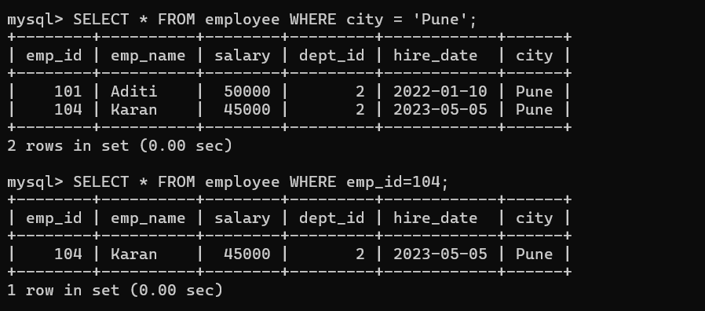
---

### ⚖️ AND / OR  
- `AND` → All conditions must be true.  
- `OR` → At least one condition must be true.  
These operators refine searches when multiple conditions are needed.

👉 Shows employees in Pune **earning more than 48,000**.  
```sql
SELECT * FROM employee WHERE city='Pune' AND salary>48000;
SELECT * FROM employee WHERE city = 'Pune' && salary > 48000;

```
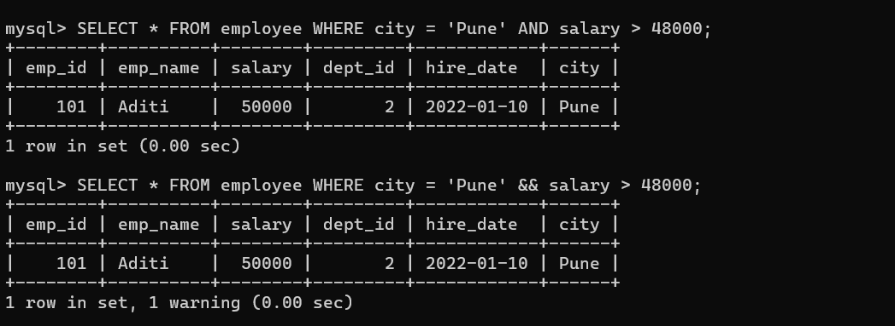

👉 Shows employees either from Delhi **or** those with salaries below 50,000.  
```sql
SELECT * FROM employee WHERE city='Delhi' OR salary<50000;
SELECT * FROM employee WHERE city = 'Delhi' || salary < 50000;
```
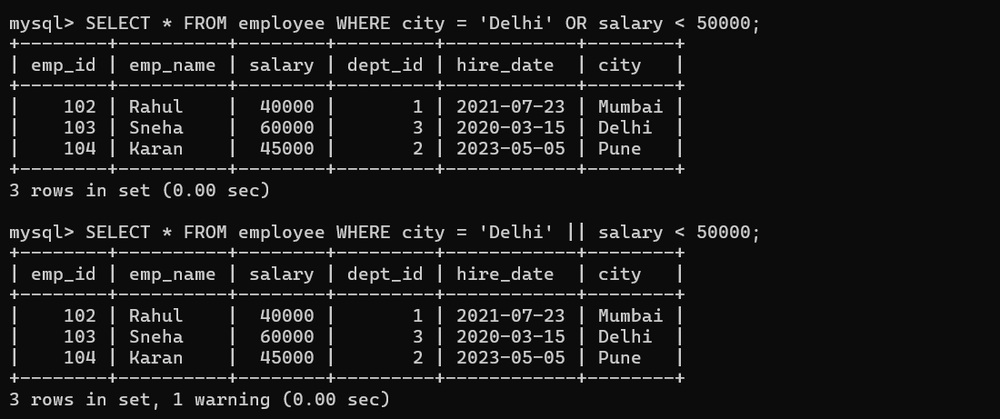
---

### 🔠 LIKE  
The `LIKE` operator is used for pattern matching in strings.  
`%` means "zero or more characters", `_` means "exactly one character".  

👉 Finds employees whose names start with the letter **S** (e.g., Sneha).  
```sql
SELECT * FROM employee WHERE emp_name LIKE 'S%';
```
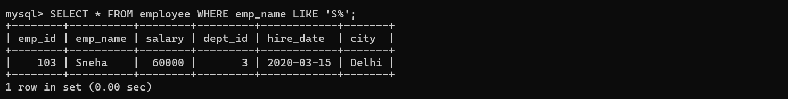
---

### 📅 BETWEEN  
The `BETWEEN` operator filters values within a range.  
It works with numbers, text, or dates.  

👉 Shows employees hired between **Jan 2021** and **Dec 2022**.  
```sql
SELECT * FROM employee WHERE hire_date BETWEEN '2021-01-01' AND '2022-12-31';
```
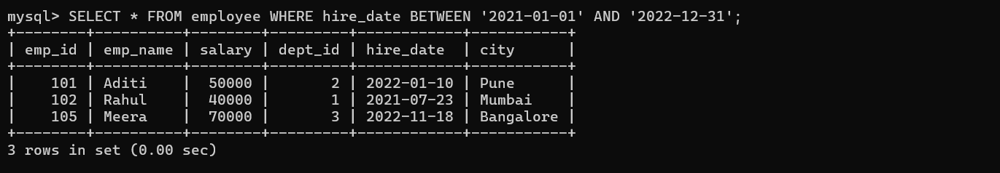
---

### 📊 ORDER BY  
The `ORDER BY` clause sorts the results in ascending (default) or descending order.  

```sql
SELECT emp_name, salary FROM employee ORDER BY salary;      
SELECT emp_name, salary FROM employee ORDER BY salary DESC;
```
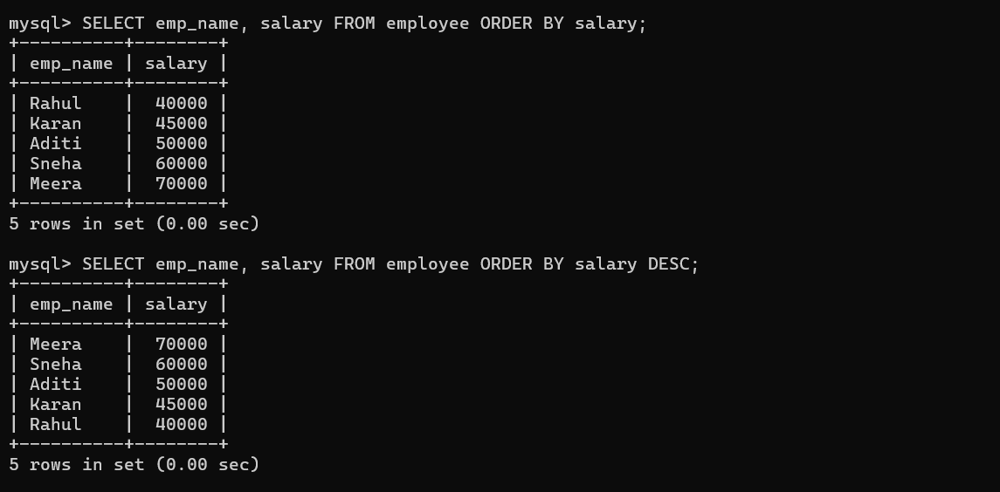

---

### ⚡ = vs IN  
- `=` is used to check equality for a **single value**.  
- `IN` is used to match **multiple values**. 

👉 Fetches employees from Pune only.  
```sql
SELECT * FROM employee WHERE city = 'Pune';
```
👉 Fetches employees either from **Pune or Delhi**.  
```sql
SELECT * FROM employee WHERE city IN ('Pune','Delhi');
```
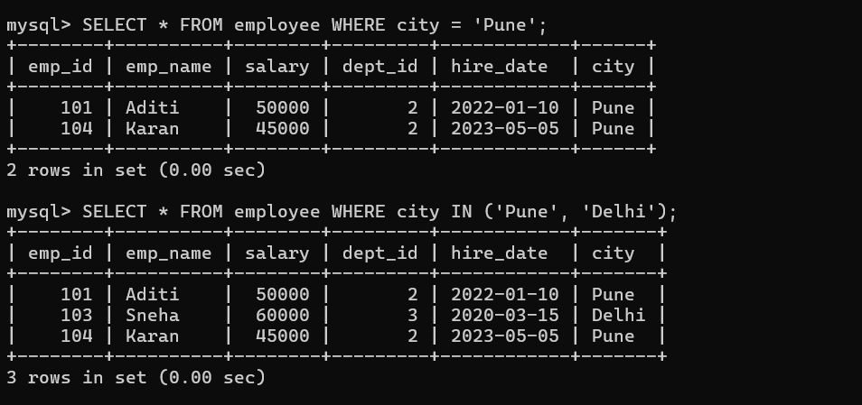
---

### ✂️ LIMIT  
The `LIMIT` clause restricts how many rows are displayed in the result.  
Useful when previewing large tables. 

👉 Only shows the first **3 employees** from the table.  
```sql
SELECT * FROM employee LIMIT 3;
```
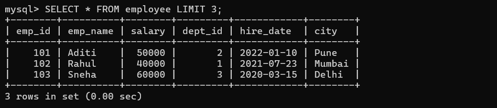
---

### 🏷️ ALIAS  
Aliases rename column names or tables to make results easier to read. 

👉 The output will display columns as **Employee** and **Monthly_Salary** instead of their original names.  
```sql
SELECT emp_name AS Employee, salary AS Monthly_Salary FROM employee;
```
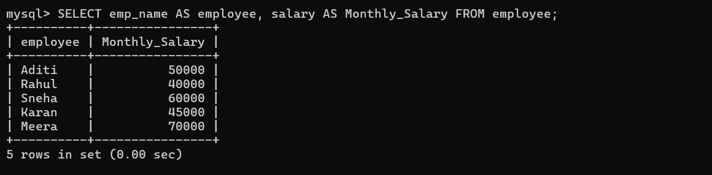

---

### 🚫 DISTINCT  
The `DISTINCT` keyword removes duplicate values from a column. 

👉 Returns a unique list of cities where employees are located (no repeats).  
```sql
SELECT DISTINCT city FROM employee;
```
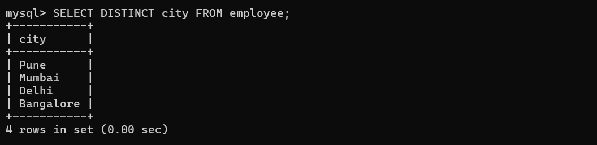

---

## 4. Summary
✅ Built **companydb** with two related tables  
✅ Applied constraints (`PRIMARY KEY`, `FOREIGN KEY`, `NOT NULL`, `UNIQUE`)  
✅ Inserted sample data for testing  
✅ Practiced key SQL queries (`SELECT`, `WHERE`, `LIKE`, `BETWEEN`, `ORDER BY`, etc.)  
✅ Covered real-world use cases of filtering, sorting, and data integrity  

---
